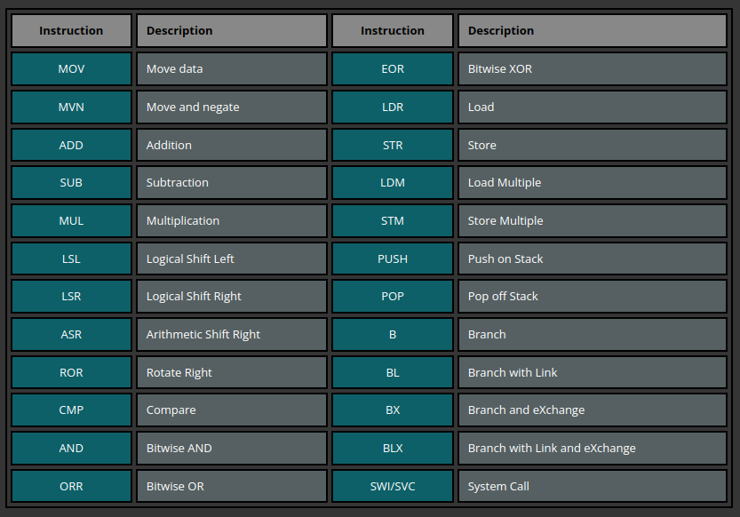

# ARM ASSEMBLY

## Registers

- from r0 to r10 = General purpose
- r11 = frame pointer
- r12 = Intra procedural call
- r13 = stack pointer
- r14 = link register
- r15 = program counter

We can compare these with assembly x86:

r0 = eax\
r1 to r5 = ebx, ecx, edx, esi, edi\
r11 = ebp\
r13 = esp\
r15 = eip\

See [here](https://azeria-labs.com/arm-data-types-and-registers-part-2/)

Let’s look at how PC behaves in a debugger. We use the following program to store the address of pc into r0 and include two random instructions. Let’s see what happens.

```bash
.section .text
.global _start

_start:
 mov r0, pc
 mov r1, #2
 add r2, r1, r1
 bkpt
 ```

 In GDB we set a breakpoint at _start and run it:

```bash
gef> br _start
Breakpoint 1 at 0x8054
gef> run
```

## ARM Instructions set

